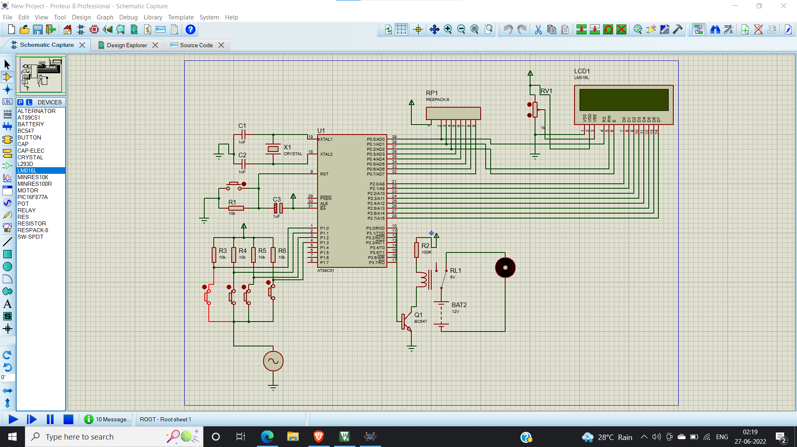

# Water Level Controller
A water level controller is a device which is used to detect the amount of water present in the tank and alert the user for low or dangerously high water level. It has a wide set of applications such as water and sewer services for office and apartment buildings, industrial applications for iron and steel, food, chemical, pharmaceutical, and semiconductor industries.

## Objective 
The objective of the project was to design a water controller that can:-
 - Monitor the level of water and switch on the supply when the tank is empty and switch off the supply when the tank is full.
 - Alert the user while doing so.
 - To make sure to save as much as water and energy as possible.
 
## Working Principle
 - Water is the conductor electricity. We use this principle to display messages on microcontroller, which are dipped in water, they detect electricity and subsequently send signal to the microcontroller indicating the level of water present in the tank and conveying whether the motor should be switched on or off.
 - When water level in the tank is low the motor is automatically switched on to fill the tank with the water and also subsequently display the message that the tank is empty on the lcd display.
 -  When water in the tank is filled to it's maximum the motor is switched off automatically and the lcd displays the message indicating that the tank is full.

## Circuit Explanation
 - The water level probes are connected to the P0.0, P0.1 and P0.2 through the transistors (they are connected to the base of the transistors through corresponding current limiting resistors). P0.0 for LOW level, P0.1 for HALF Level and P0.2 for HIGH Level.
 - The Collector terminals of the Transistors are connected to VCC and the Emitter terminals are connected to PORT0 terminals (P0.0, P0.1 and P0.2).
 - PORT1 of the microcontroller is connected to the data pins of LCD and the control pins RS, RW and EN of the LCD Display are connected to the P3.6, GND and P3.7 respectively.
 - For demonstration purpose, we have used a simple DC Motor Pump. It is connected to the Relay and the input to the relay is fed from P0.7 through a transistor.
### Components Required
 - 8051
 - 5 x 10kR resistors
 - 1 x relay
 - 1 x dc motor pump
 - 1 x alternator
 - 2 x 1nF capacitors
 - 1 x LCD
 - 1 x 100R resistor
 - 1 x generic electrolyte capacitor
 - 1 x generic non-electrolyte capacitor
 - 5 x buttons
 
 ## Algorithm
 - First configure the controller pins P0.0, P0.1 and P0.2 as inputs and P0.7 as output.
 - Now, initialize the LCD.
 - Continuously check the water level input pins P0.0, P0.1 and P0.2.
 - If all the pins are low, then display tank as “EMPTY” on the LCD and make P0.7 pin HIGH to run the motor automatically.
 - If the level is low i.e. if P0.0 is HIGH, display the water level as “LOW” and continue to run the motor.
 - A HIGH pulse on the pin P0.1 indicates that water has reached half level. So, display the same thing on LCD and run the motor normally.
 - If P0.2 is HIGH, then the water level in the tank is FULL.
 - Now, make the P0.7 pin as LOW to turn off the motor automatically.
 
 ## Limitations
 - 8051 uses more number of clock cycles for instruction execution. Thus it cant be used for high speed applications.
 - We use external oscillator in 8051 which adds to external circuitry.
 - 8051 does not have inbuilt ADC
 - 8051 has 11.0592 MHz frequency which is slower compared to other microcontrollers.

 ## Circuit
 
